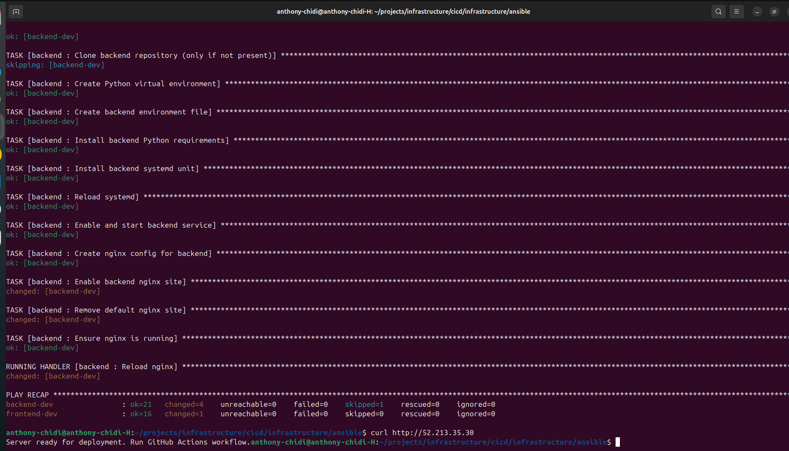
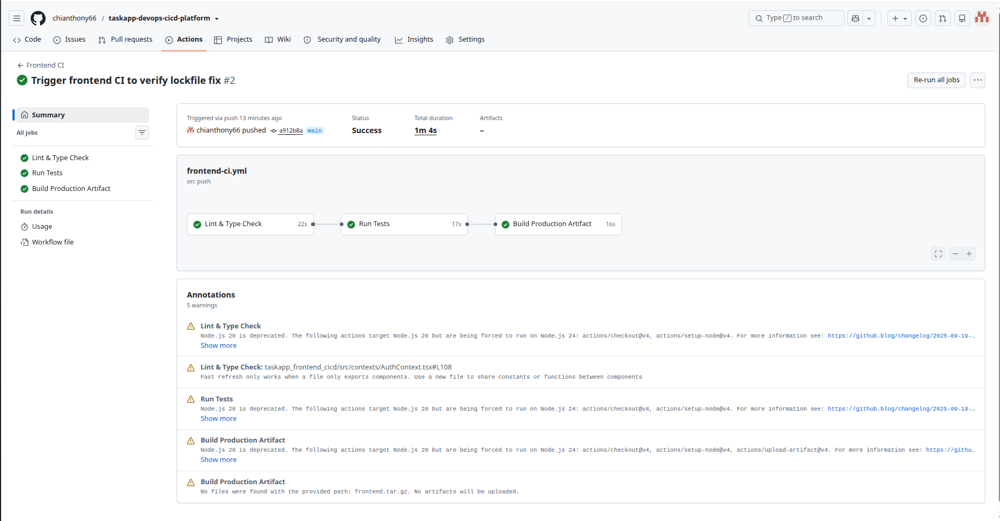
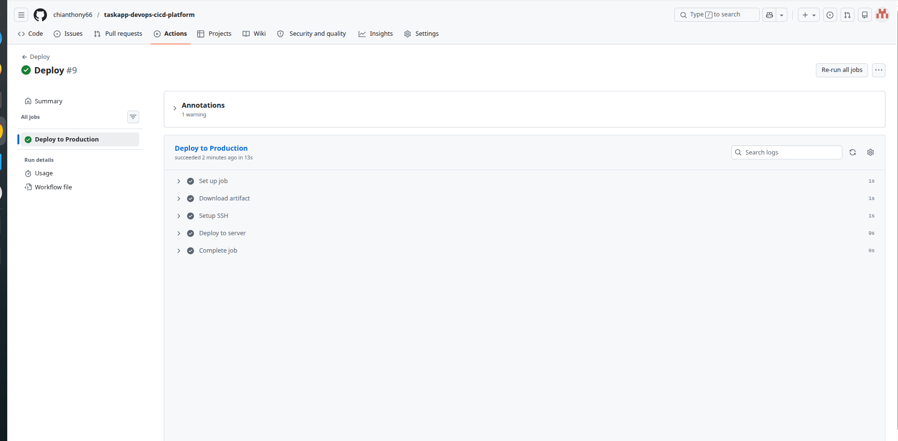
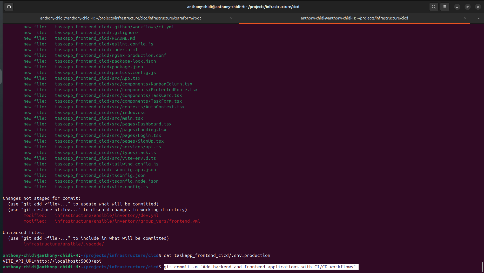

# TaskApp DevOps CI/CD Platform

A production-ready DevOps platform demonstrating Infrastructure as Code (IaC), Configuration Management, Continuous Integration, and Continuous Deployment on AWS using Terraform, Ansible, GitHub Actions, Flask, React, PostgreSQL, and Nginx.

---

## Project Overview

This project showcases the implementation of a complete DevOps workflow, from infrastructure provisioning to automated application deployment.

The platform consists of:

- React Frontend Application
- Flask Backend API
- PostgreSQL Database
- Nginx Reverse Proxy
- AWS Cloud Infrastructure
- Automated CI/CD Pipelines

The primary objective of this project was to automate infrastructure provisioning, server configuration, testing, and deployment while following DevOps best practices.

---

## Technology Stack

### Cloud Platform

- AWS EC2
- AWS VPC
- Security Groups

### Infrastructure as Code

- Terraform

### Configuration Management

- Ansible

### Backend

- Python
- Flask
- SQLAlchemy
- Alembic
- PostgreSQL

### Frontend

- React
- TypeScript
- Vite
- Tailwind CSS

### CI/CD

- GitHub Actions

### Web Server

- Nginx

---

## Infrastructure as Code

Infrastructure provisioning is fully automated using Terraform.

Provisioned resources include:

- VPC
- Public Subnets
- Security Groups
- Frontend EC2 Instance
- Backend EC2 Instance
- PostgreSQL Database

Terraform modules are organized under:

```text
infrastructure/terraform/modules
```

---

## Configuration Management

Server configuration and application setup are automated using Ansible.

Configured services include:

- Python Runtime
- Nginx
- Backend Application Service
- Frontend Hosting
- Environment Configuration

Ansible roles include:

```text
common
backend
frontend
```

*Ansible playbook execution — backend and frontend servers configured successfully:*



---

## CI/CD Pipeline

### Backend Continuous Integration

The backend CI pipeline performs:

1. Code Quality Checks
2. Security Scanning
3. Automated Testing
4. Artifact Creation

*Frontend CI Pipeline — Lint, Test, and Build stages passing successfully:*



### Backend Continuous Deployment

Deployment is automatically triggered after a successful CI run.

Deployment stages include:

1. Download Deployment Artifact
2. SSH Authentication
3. Application Deployment
4. Service Restart
5. Deployment Verification

*Backend deployment to AWS EC2 — all stages completed successfully:*



*GitHub Actions secrets used to securely store deployment credentials:*



---

## Application Components

### Backend

Location:

```text
taskapp_backend_cicd/
```

Features:

- User Authentication
- Task Management API
- Database Migrations
- Automated Unit Tests

### Frontend

Location:

```text
taskapp_frontend_cicd/
```

Features:

- Authentication Pages
- Dashboard
- Kanban Board
- Protected Routes
- API Integration

---

## Repository Structure

```text
taskapp-devops-cicd-platform
├── infrastructure
│   ├── terraform
│   └── ansible
├── taskapp_backend_cicd
├── taskapp_frontend_cicd
└── .github/workflows
```

---

## Deployment Workflow

Developer Push

↓

GitHub Actions CI

↓

Code Quality Checks

↓

Automated Testing

↓

Artifact Creation

↓

GitHub Actions CD

↓

AWS EC2 Deployment

↓

Application Available

---

## Challenges Encountered and Solutions

### Artifact Upload Failure

**Issue**

Deployment artifacts were not being uploaded due to an incorrect artifact path configuration.

**Solution**

Updated the artifact upload path and verified artifact generation before upload.

### SSH Authentication Failure

**Issue**

Deployment failed with:

```text
Permission denied (publickey)
```

**Solution**

The EC2 server trusted an ED25519 key while GitHub Actions was authenticating with an RSA key stored in GitHub Secrets. The corresponding RSA public key was generated and added to the EC2 server's `authorized_keys` file, allowing successful authentication and deployment.

---

## Key Achievements

- Provisioned AWS infrastructure using Terraform
- Automated server configuration with Ansible
- Built CI/CD pipelines using GitHub Actions
- Automated backend deployment to AWS EC2
- Configured Nginx reverse proxy
- Integrated PostgreSQL database
- Implemented secure SSH-based deployments
- Troubleshot and resolved deployment authentication issues
- Applied Infrastructure as Code and DevOps best practices

---

## Future Improvements

- Containerize applications using Docker
- Implement Kubernetes deployment
- Add Prometheus and Grafana monitoring
- Implement Blue-Green deployments
- Add centralized logging and alerting

---

## Author

**Anthony Chidi**

*DevOps Engineer | Cloud Engineer | CI/CD & Infrastructure Automation*
